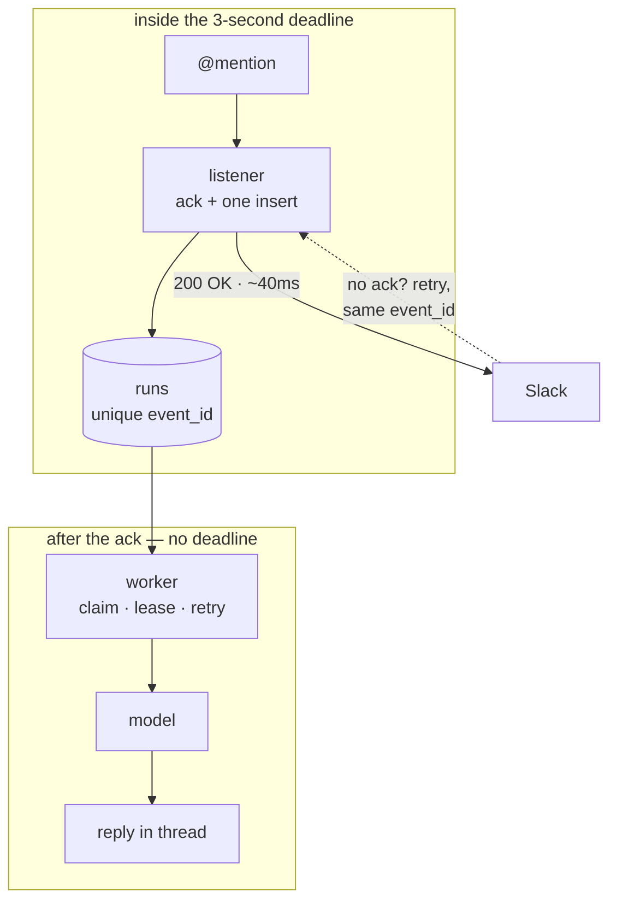
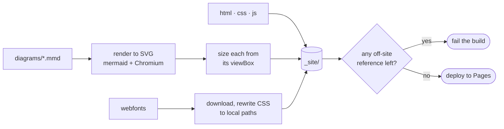

# claude-tag-poc


**You `@mention` a bot in a chat thread. It reads the room and answers in place.**
That sounds like a chatbot. It isn't — and the reason is a three-second deadline.

▸ **[Open the simulator](https://rppol.github.io/claude-tag-poc/)** — a chat workspace on one
side, the agent runtime that serves it on the other, and nine scenarios you can run.

---

## Read this first: what is real here

This repo contains **a working backend** and **a design for a much larger one**. They are not
the same size, and every surface says which is which.

| | Status |
|---|---|
| Ack inside the 3s deadline, retry dedupe | **in the repo**, tested |
| Durable queue: claim, lease, reclaim after a crash | **in the repo**, tested |
| Bounded retry with backoff, no duplicate posts | **in the repo**, tested |
| One model call, failover across free models | **in the repo**, tested |
| Multi-agent graph, scoped memory, MCP, A2A, ambient | **designed only** — drawn, not built |

The simulator tags every scenario `in the repo` / `partly built` / `design only`.
`tools/run_scenarios.py` exercises only the first four rows, and says so in its own output.

---

## The one constraint

Slack's Events API wants `HTTP 200` within **three seconds**, and retries with the **same
`event_id`** when it doesn't get one. So a slow handler doesn't just time out — it produces
*duplicate work*.

Split the system at that deadline and everything else follows.



Two consequences worth naming:

- **The retry storm becomes a database constraint.** `UNIQUE(event_id)` turns Slack's three
  retries into two rejected inserts. No coordination, no locks, no dedupe service.
- **Everything slow moves past the seam** — which is what makes a *team* of agents possible
  later. None of that fits in three seconds.

---

## Run it

**Checks** — no dependencies, no credentials, no network:

```bash
python3 test_worker.py                  # 13 checks
```

**Scenarios** — the real backend against a live free model:

```bash
OPENROUTER_API_KEY=sk-or-v1-... python3 tools/run_scenarios.py
```

**The whole thing, against Slack:**

```bash
pip install -r requirements.txt
export SLACK_BOT_TOKEN=xoxb-...  SLACK_APP_TOKEN=xapp-...  OPENROUTER_API_KEY=sk-or-v1-...
python3 app.py      # terminal 1 — listener
python3 worker.py   # terminal 2 — does the work
```

<details>
<summary><b>Slack app setup</b> — three settings</summary>

At [api.slack.com/apps](https://api.slack.com/apps):

1. **Socket Mode** → enable, generate an App-Level Token with `connections:write` → `SLACK_APP_TOKEN`
2. **OAuth & Permissions** → bot scopes `app_mentions:read`, `channels:history`, `chat:write` → install → `SLACK_BOT_TOKEN`
3. **Event Subscriptions** → subscribe to the bot event `app_mention`

Socket Mode means no public URL and no ngrok — the app dials out.
</details>

<details>
<summary><b>Models</b> — free tier only, and a list rather than a pin</summary>

The worker walks a preference list and fails over on a 429, an empty completion, or a
transport error. On a cold probe of six free models, **two were already rate-limited and one
returned a null completion** — so failover is the common path, not an edge case.

Order is by measured behaviour, not size: `poolside/laguna-s-2.1:free` answers a real thread in
~4s; `nemotron-3-super-120b:free` took 12s and leaked its reasoning into the reply. Override the
whole list with `OPENROUTER_MODEL`.

Avoid OpenRouter's `openrouter/free` auto-router — it routed a plain chat request to a
content-safety classifier, which returned no content at all.
</details>

<details>
<summary><b>macOS</b> — <code>CERTIFICATE_VERIFY_FAILED</code></summary>

Your Python has no CA bundle. Run `Install Certificates.command` from your Python's
Applications folder, or:

```bash
export SSL_CERT_FILE="$(python3 -c 'import certifi; print(certifi.where())')"
```
</details>

---

## How this is verified

A check that cannot fail is worse than no check. Untested code *looks* untested; falsely
verified code looks verified, so it displaces the scrutiny that would have caught it.

An adversarial review found three checks here that passed against broken behaviour. All are
fixed, and each remaining one is now verified **by breaking the thing it names**:

| break this | this check | result |
|---|---|---|
| `UNIQUE(event_id)` | `sc_dedupe` | caught |
| the lease sweep | `sc_lease_recovery` | caught |
| the attempts ceiling | `sc_attempt_ceiling` | caught |
| the transcript — model ignores it | `sc_answer` | caught |
| every model — total outage | `sc_injection` | caught |
| `BEGIN IMMEDIATE` | `sc_two_workers` | caught |

`tools/test_build_guard.sh` does the same for the build: it plants an off-site URL in a copy of
the output and asserts the build rejects it. The previous version of that guard **could not
fail** — conflicting `grep` flags, the error swallowed, the exit status read from the wrong end
of a pipe.

**Not verified:** the live Slack round trip. Everything downstream of `app.py` is exercised;
the Slack half needs a workspace and a bot token.

---

## Layout

| Path | Job |
|---|---|
| `app.py` | Listener. Acks inside 3s, writes one row, returns. |
| `worker.py` | Claims a run, reads the thread, calls the model, posts back. |
| `db.py` · `schema.sql` | The queue: enqueue, claim, lease, finish, fail. |
| `test_worker.py` | 13 checks. No framework, no network. |
| `tools/run_scenarios.py` | The real backend through manufactured threads, live model. |
| `docs/` | The simulator: `index.html`, `sim.js`, `style.css`, `diagrams/*.mmd`. |
| `tools/build.sh` | Renders diagrams, self-hosts fonts, assembles `_site/`. |

**[DESIGN.md](./DESIGN.md)** covers why it is shaped this way and what was deliberately left out.

---

## The build

The published page fetches **nothing** at runtime — no CDN, no font service, no diagram
library. Everything expensive happens in CI:



`svgfix.py` exists for one reason: mermaid emits `width="100%"`, which an `` has no
containing block to resolve — so every diagram silently rendered at the 300×150 fallback and
clipped. It now sizes each from its `viewBox`.

Run it locally with `./tools/build.sh`, then serve `_site/`.
